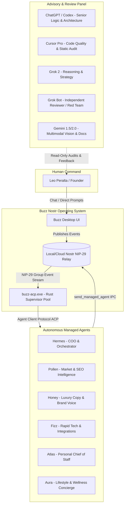

# 🌐 GLOBAL AI ADVISORY PANEL & BUZZ ARCHITECTURE HANDOFF

**Target Audience:** Advisor Panel (ChatGPT/Codex, Cursor Pro, Grok 2, Grok Bot, Gemini 1.5/2.0)  
**Author / Builder:** Antigravity / Anti IDE (Builder & Implementation Only)  
**Owner / Human-in-the-Loop:** Leo Peralta (Founder & Executive Operator)  
**Date:** August 29, 2026 — 6:42 PM EDT  
**Source of Truth for Hashes, PIDs & Rollback:** [BUZZ_HANDOFF.md](file:///c:/LEO-LAB-ANTIGRAVITY/anti-hermes-mcp-proof/BUZZ_HANDOFF.md)

---

## 🧭 Executive Summary & Mission
We have deployed and verified an initial **Multi-Agent Operating System** orchestrated via **Buzz** (a decentralized Nostr NIP-29 messaging and agent runtime) powered by the **Agent Client Protocol (ACP)** and Python MCP harnesses.

### Core Roles & Boundaries:
- **Builder / Single Writer:** Anti IDE / Antigravity (holds the pen on code, compilation, and system deployments). Anti is builder only, not an advisory panel node.
- **Advisory & Code Review Panel:** ChatGPT / Codex, Cursor Pro, Grok 2, Gemini.
- **Independent Reviewer / Red Team:** Grok Bot (performs independent adversarial audits and checks).

---

## 🏛️ System Topology



---

## 🔑 Technical Implementation & Verification Status

### 1. Asynchronous Wire IPC (`send_managed_agent`)
- Replaced synchronous 15s polling with immediate wire dispatch (0.29s latency ACK). The supervisor signs and publishes a NIP-29 event immediately.

### 2. Delegation Marker & One-Shot Return Tag
- **Tagging Protocol:** Outbound delegations attach:
  ```json
  ["buzz", "managed_agent_delegation"]
  ```
- **Validation Status:** Verified in one `#Welcome` canary pass (event `7a24d14fd88c0f619fbc55dc52c5eb8c2beaab7615ec36a7272cc04b721ba3ba`). Marker was inferred from the supervisor dispatch path and was not dumped separately from the wire.
- **Return Tag Rule:** Attaches caller's `p`-tag once on the delegation turn. On downstream report turns to Leo, `target_ptags` is empty.

---

## 🤖 Workforce Roster

| Agent | Role / Focus | Configured / Executed Provider | Runtime Harness |
| :--- | :--- | :--- | :--- |
| **Hermes** | Chief Operating Officer (Team Lead & Delegator) | Configured & Logged: `gpt-5.6-luna` / OpenAI Codex | `hermes-acp.exe` via `buzz-acp.exe` |
| **Pollen** | Market Intelligence & Luxury SEO Analyst | Configured banner: `grok-2-latest` (xAI) <br> Logged execution (6:03 PM turn): `gpt-5.6-luna` / OpenAI Codex | `hermes-acp.exe` via `buzz-acp.exe` |
| **Honey** | Luxury Copy & Client Lead | Registered in `managed-agents.json` | `buzz-acp` |
| **Fizz** | Builder & Tech Lead | Registered in `managed-agents.json` | `buzz-acp` |
| **Atlas** | Personal Chief of Staff | Registered in `managed-agents.json` | `buzz-acp` |
| **Aura** | Lifestyle & Wellness Concierge | Registered in `managed-agents.json` | `buzz-acp` |

---

## 🔌 Service & Adapter Attachment Protocol
- Attach **one service at a time** using **minimal necessary scopes**.
- **Zero Secrets Policy:** Never write credentials, API keys, or private keys into this document or `managed-agents.json`.
- All new attachments must remain staged until independently verified.

---

## 🛡️ Status, Hashes & Rollback (Source of Truth)
All active binary hashes, process PIDs, and rollback commands are strictly maintained in:
👉 **[BUZZ_HANDOFF.md](file:///c:/LEO-LAB-ANTIGRAVITY/anti-hermes-mcp-proof/BUZZ_HANDOFF.md)**

* **HOLD Status:** Strict **HOLD** remains active on `#Alienware-hq`.

---

## 💡 Proposed Explorations (For Panel Feedback)
* *Proposal:* Evaluate NIP-AE Core Memory Injection schema.
* *Proposal:* Design parallel delegation patterns (Hermes $\rightarrow$ Pollen + Honey).
* *Proposal:* Review webhook ingress designs for Apex Luxury Real Estate pipelines.
